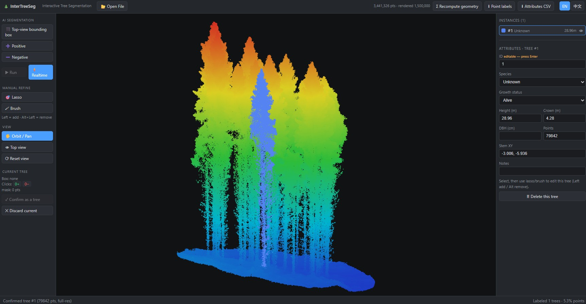

<div align="center">

# 🌲 InterTreeSeg

**Interactive, click-guided tree instance segmentation for forest LiDAR point clouds — built on [Point Transformer V3](https://github.com/Pointcept/PointTransformerV3).**

[](https://www.python.org/)
[](https://pytorch.org/)
[](https://developer.nvidia.com/cuda-toolkit)
[](LICENSE)

[Highlights](#-highlights) · [Installation](#-installation) · [Quick start](#-quick-start) · [Usage](#-usage) · [Results](#-results) · [Citation](#-citation)

</div>

---

## Overview

Instead of end-to-end instance segmentation, **InterTreeSeg** frames the problem as
**click-guided foreground/background segmentation**. For each candidate tree a
positive click (and optional negative clicks) is encoded as a Gaussian *heat*
channel over the points; PTv3 predicts a *this-tree-vs-rest* mask; clicks are
refined iteratively wherever the IoU is low; and the per-tree masks are merged
back into a full-scene instance labeling.

This repository is a clean, configuration-driven rewrite of a research prototype,
packaged for reuse and reproducibility.

## ✨ Highlights

- **One config drives everything** — model backbone, input channels, clicks,
  optimizer/scheduler, training, and inference all come from a single YAML file.
- **Configurable multi-channel input** — go beyond `xyz` (intensity, return
  number, RGB, …) by editing one config list; the network's `in_channels` is
  **derived automatically** and can never drift from the data.
- **Backward compatible** — the default config reproduces the original trained
  checkpoints exactly, so released weights load with `strict=True`.
- **Reproducible & tested** — layered tests from channel-math up to end-to-end
  GPU scene inference; a fully-resolved config is saved with every run.

## 🖥️ Interactive web app

The repo also ships a browser-based **interactive annotation app** (`app/`):
frame a tree in a top-view box, place positive/negative clicks, get real-time
segmentation, refine with clicks or lasso/brush, and export full-resolution
per-point instance labels + a per-tree attribute table. FastAPI backend
(in-process GPU inference via this library) + React/three.js frontend.



See [`app/README.md`](app/README.md) for setup and usage.

## 📦 Installation

The model depends on CUDA-specific builds of `torch`, `spconv`, `flash-attn`, and
`torch-scatter`. The reference environment is Python 3.8 / CUDA 11.8 with
torch 2.1.0, spconv-cu118 2.3.6, flash-attn 2.6.3, torch-scatter 2.1.2 (see
[`requirements.txt`](requirements.txt) for exact versions).

```bash
git clone <your-fork-url> InterTreeSeg
cd InterTreeSeg
pip install -e .            # core
pip install -e ".[prep]"    # + offline data-prep (Hilbert serialization)
```

Or run inside a prebuilt container (host path mounted at `/workspace`):

```bash
docker run --rm --gpus all -v /path/to/data:/workspace <image> \
  bash -lc 'cd /workspace/InterTreeSeg && export PYTHONPATH=. && <command>'
```

## 🚀 Quick start

```bash
# Interactive whole-scene inference over a folder of scene .txt files
python tools/infer_scene.py \
  --cfg configs/default.yaml \
  --ckpt checkpoints/model.pth \
  --scene_dir /path/to/scenes \
  --log_dir demo --n_clicks 5

# Train (reproduces the released architecture)
python tools/train.py --cfg configs/default.yaml --log_dir my_run --loss combined

# Instance-level evaluation (per-instance IoU, detection @ IoU>0.7)
python tools/evaluate.py --pred result/demo/scenes --detection_iou 0.7
```

## 📖 Usage

**Full guide: [USAGE.md](USAGE.md) (English) · [USAGE.zh.md](USAGE.zh.md) (中文)** —
adding test data, preparing training data, training, multi-channel input, and
evaluation, with copy-pasteable commands.

### Multi-channel example

To also feed intensity (source column 3) into the network, use
[`configs/multichannel_intensity.yaml`](configs/multichannel_intensity.yaml),
which only overrides:

```yaml
data:
  feat_channels: [3]          # -> in_channels = 1 (intensity) + 2 (clicks) = 3
  feat_norm: [standardize]
```

A multi-channel model cannot load a 2-channel checkpoint with `strict=True` (the
embedding stem differs) — this is expected; train from scratch or fine-tune with
`strict=False`, re-initializing only the embedding stem.

## 🗂️ Data format

**Scene files (inference / evaluation)** — whitespace- or comma-delimited `.txt`,
one point per row. Column meaning is set by the `data` block in the config.
Common layouts:

| Layout | Columns |
| --- | --- |
| 6-col (default) | `x y z intensity treeID label2` |
| 10-col | `x y z intensity return_number number_of_returns scan_angle_rank treeID treeSP classification` |

`data.label_channel` (default 4) selects the instance-ID column (0 = ground).

**Training blocks** — HDF5 with `data` `(B, N, C)` and `label` `(B, N)`, produced
offline by [`tools/prepare_data.py`](tools/prepare_data.py) from raw scene txt.

## 📊 Results

Interactive inference on a FORinstance test plot (~64 trees) with the released
2-channel checkpoint — per-block segmentation mIoU improves with each added
click:

| Click round | 1 | 2 | 3 | 4 | 5 |
| --- | --- | --- | --- | --- | --- |
| mIoU | 49.8 | 52.4 | 59.4 | 66.7 | **72.0** |

Full-scene merge IoU **0.86**; 10 / 65 instances detected at IoU > 0.7; ~7 s/scene
on an RTX 3090 Ti.

## 🏗️ Repository structure

```
intertreeseg/
  config.py            # YAML load / merge / overrides
  models/              # vendored PTv3 (ptv3.py, serialization/) + build_model factory
  data/                # ChannelSpec, normalize, augment, clicks, datasets, loader
  losses/              # crossentropy | focal | tversky | combined  (build_loss)
  metrics/             # ConfusionMatrix / AverageMeter + instance-level IoU
  engine/              # optimizer/scheduler build, trainer, tester, interactive inference
  evaluation/          # scene reassembly (merge) + instance evaluation report
  utils/               # logging, ply/h5 I/O, seeding, runtime helpers
tools/                 # CLI entry points (train, test_h5, infer_scene, prepare_data, evaluate, run_batch)
configs/               # default.yaml (+ multichannel variant)
tests/                 # channel-math, checkpoint-compat, forward, multichannel, scene inference
```

## 🔖 Model checkpoints

The released weights use `in_channels = 2` (xyz + 2 click channels) and are
reproduced exactly by `configs/default.yaml`, so they load with
`load_state_dict(..., strict=True)`. Point `--ckpt` at the checkpoint file when
running inference.

## 📝 Citation

If you use this code, please cite **Point Transformer V3**. The PTv3 backbone in
`intertreeseg/models/ptv3.py` is derived from the official Pointcept release.

```bibtex
@inproceedings{wu2024ptv3,
  title     = {Point Transformer V3: Simpler, Faster, Stronger},
  author    = {Wu, Xiaoyang and others},
  booktitle = {CVPR},
  year      = {2024}
}
```

## 🙏 Acknowledgements

- [Point Transformer V3 / Pointcept](https://github.com/Pointcept/PointTransformerV3) — backbone.
- [FOR-instance](https://zenodo.org/records/8287792) and related forest LiDAR datasets used for evaluation.

## ⚖️ License

InterTreeSeg is **dual-licensed**:

- **Open source:** [GNU AGPL-3.0](LICENSE) — free for research, teaching, and any
  project that is itself AGPL-3.0. Note that under the AGPL, **network use counts
  as distribution**: offering this functionality as a hosted service requires
  publishing your corresponding source.
- **Commercial:** for proprietary/closed-source use, commercial hosted services,
  or a patent license — see [COMMERCIAL-LICENSE.md](COMMERCIAL-LICENSE.md).

### Patent Notice

The methods implemented here are covered by a patent application held by
**East China Normal University**:

- Application No. **CN202510762230.X** (published 2025-10-03)

**All patent rights are expressly reserved.** Distribution under the AGPL-3.0
conveys only the patent rights granted by AGPL-3.0 §11 to recipients of the
AGPL-licensed work — no other patent license, express or implied, by estoppel or
otherwise, is granted. Commercial or proprietary use of the patented methods
requires a separate license.

### Third-party code

This project incorporates Point Transformer V3 (MIT, © 2023 Pointcept). See
[THIRD_PARTY_NOTICES.md](THIRD_PARTY_NOTICES.md).

Copyright © 2026 East China Normal University. All rights reserved.

## 👥 Authors

Jun Li, Lanying Wang, Wentao Sun, Hanqing Xu, Lingfei Ma — East China Normal University.
